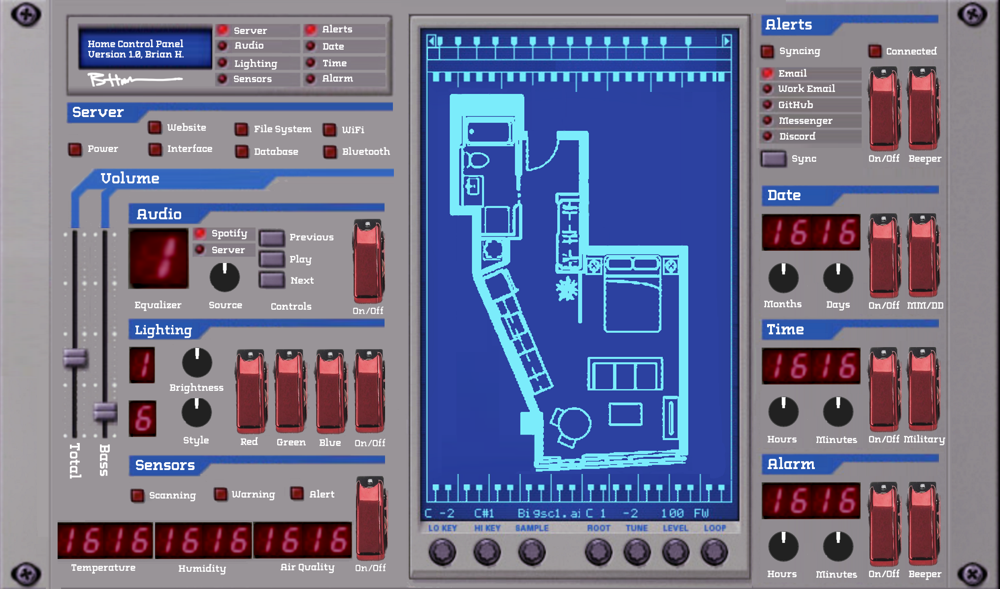

# Home Control Panel

A project budding from a thought experiment on UI design and a desire for tactility, the Home Control Panel aims to be both functional and artistic as it controls all desired aspects of a modern home.

## Initial Concept 

## Supplies

All items were purchased off Amazon

### Frame/Structure

- Quadro Frames 12x20 inch Picture Frame, Black, Style P375-3/8 inch Wide Molding, Box of 2 
- Kydex T Sheet, P3 Velour Matte, Pewter Gray, Meets UL 94V0 and 945V Specifications, 0.060" Thickness, 12" Width, 24" Length 

### Switches and I/O

- 3 of ESUPPORT Car Red Cover Red LED Light Rocker Toggle Switch SPST ON Off Pack of 5 
- WINGONEER® Electronic Building Block 10K Double Row Sliding Linear Potentiometer Module for Arduino Mixer Linear Sliding Resistance 
- uxcell Common Cathode 12Pin 4 Bit 7 Segment 1.98 x 0.75 x 0.31 Inch 0.55" Red LED Display Digital Tube 10pcs 
- Seloky 10pcs Rotary Encoder Module KY-040 for Arduino Compatible Brick Sensor Switch Development Board（With 10 black knobs and Threaded） 
- Raspberry Pi 10 Inch Touch Screen - SunFounder 10.1" HDMI 1280x800 IPS LCD Touchscreen for RPi 4 Model B 3 Model B+ 3B 2B LattePanda Beagle Bone 

Total price: ~$300.